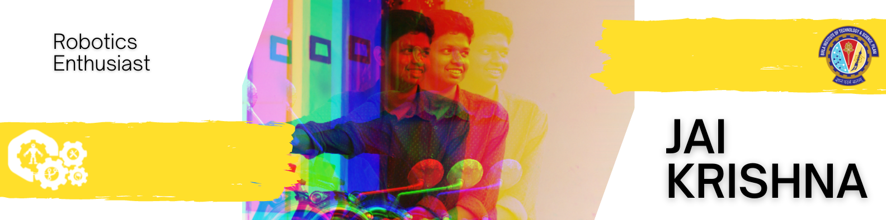

<h2 align="center">A perfectly clear photograph is a distortion of reality</h1>
<h3 align="center">Robotics | Electronics | Desgin</h3>

### Quick Links

- 👨‍💻 All of my projects are available at [Portfolio](https://textzip.github.io)

- 📝 I regularly write articles on [Portfolio](https://textzip.github.io)

- 📫 How to reach me **textzip@gmail.com**

- 📄 Know about my experiences [https://textzip.github.io/about/](https://textzip.github.io/about/)

### Latest From My Blog
<!-- BLOG-POST-LIST:START -->
- [AVR Diaries 02 - Interrupts](https://textzip.github.io/posts/AVR-Diaries-02-Interrupts/)
- [Robotics Theory - 2D Robotics](https://textzip.github.io/posts/2D-Robotics/)
- [AVR Diaries 03 - Timers](https://textzip.github.io/posts/AVR-Diaries-03-Timers/)
- [AVR Diaries 01 - Port Manipulation](https://textzip.github.io/posts/AVR-Diaries-01-Port-Manipulation/)
- [ROS Basics](https://textzip.github.io/posts/ROS-Baiscs/)
<!-- BLOG-POST-LIST:END -->
<!--
<h3 align="left">Connect with me:</h3>

-->

<h3 align="left">Languages and Tools:</h3>

             

&nbsp;

